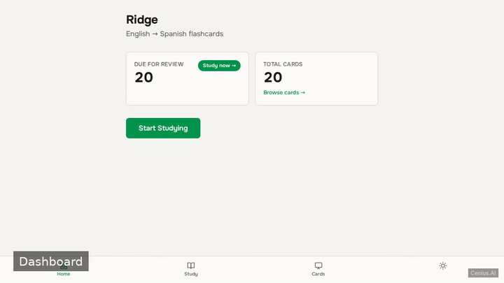
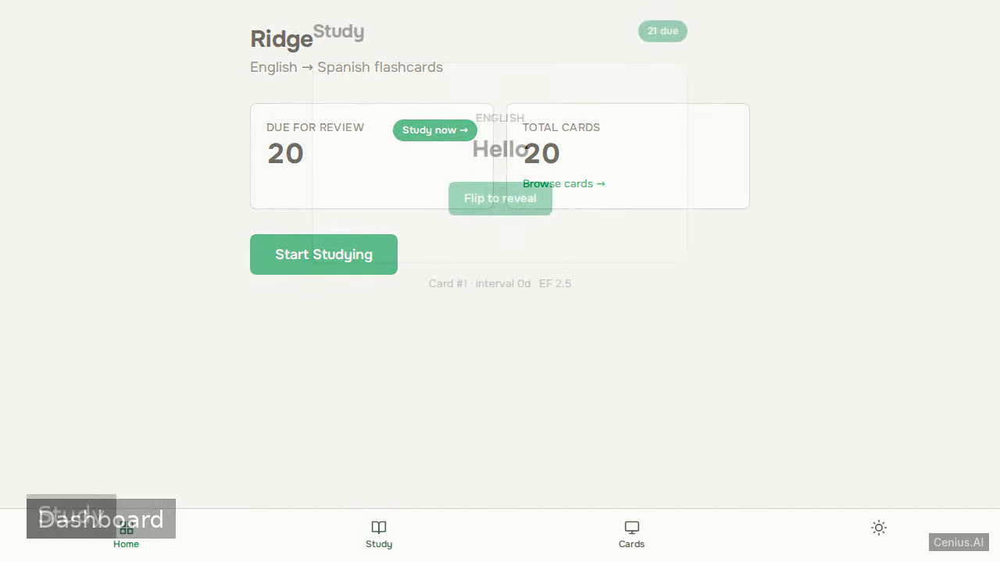
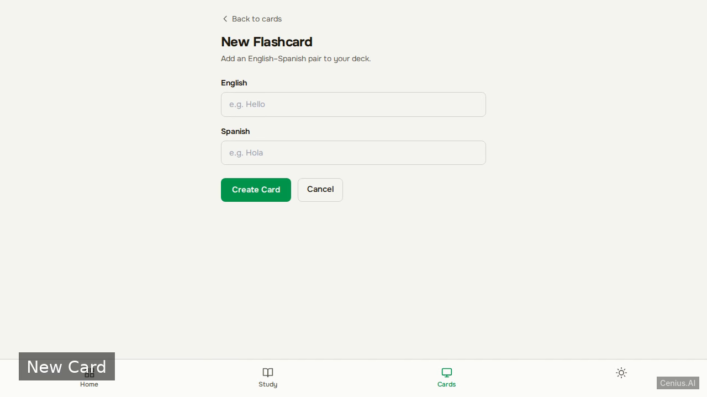

# Ridge Language Flashcards — Go pet learning platform reference implementation

If you want a self-hosted learning platform without the vendor lock-in, **Ridge Language Flashcards** is ready to run. Built with Go and Apache-2.0-licensed, Ridge Language Flashcards ships complete — one clone, one install command. A single-user web application for learning English-to-Spanish vocabulary using spaced repetition (SM-2 algorithm). [Open Ridge Language Flashcards on cenius.ai](https://cenius.ai/marketplace/p/ridge-language-flashcards?ref=gh&utm_campaign=ridge-language-flashcards-golang) to customise it without touching a line of Ridge Language Flashcards code.


[](LICENSE)  [](https://cenius.ai)

[](https://cenius.ai/marketplace/p/ridge-language-flashcards?ref=gh&utm_campaign=ridge-language-flashcards-golang)

> **▶ [Open & edit in cenius.ai](https://cenius.ai/marketplace/p/ridge-language-flashcards?ref=gh&utm_campaign=ridge-language-flashcards-golang)** — one click to an editable workspace: describe changes in plain English, get an instant preview, one-click deploy and host. Modifications made on the platform come with full rebrand & relicense rights.

_Local clone? See [Quick start](#quick-start) below. cenius.ai is the zero-setup path._

## Demo



📽 **[Watch the walkthrough](https://cenius.ai/marketplace/p/ridge-language-flashcards?ref=gh&utm_campaign=ridge-language-flashcards-golang)** — plays on cenius.ai · [MP4 file](.github/media/demo.mp4)

## Screenshots

  

## Architecture

The repository contains 44 files of Go source, organised under `src/`, `static/`, `templates/`. One command (`./install.sh`) covers dependency setup and demo-data seeding. Installation walkthrough: [`INSTALL.md`](INSTALL.md).

## Features

- Study flashcards with SM-2 scheduling
- Browse all flashcards
- Add new card
- Edit existing card
- Delete card
- Dashboard with due count

## Quick start

```bash
./install.sh   # installs dependencies + seeds demo data
```

See [`INSTALL.md`](INSTALL.md) for full setup and usage instructions.

## Usage guide

### Access the Application

Once the development server is running (`cargo run`), open a browser and go to:
```
http://localhost:8080
```

All pages share a common layout (`templates/layout.html`) and automatically adapt to your system’s light/dark mode preference.

---

### Dashboard

**URL:** `/`

Displays your study progress:
- Number of cards due for review
- Total cards in the collection

A button or link lets you start a study session.

### Study Session

**URL:** `/study`

Presents one flashcard at a time. After revealing the answer, you rate how well you recalled it. The app uses the SM‑2 algorithm to schedule the next review.

**Answer Submission**  
`POST /study/answer`  
This endpoint receives your rating and updates the card’s schedule.

When all due cards have been reviewed, you are redirected to the study completion page.

### Study Complete

**URL:** (rendered after finishing a study session)  
Confirms that you have completed the current batch of cards.

### Card Management

#### List All Cards
**URL:** `/cards`  
Shows a table of all flashcards with options to edit or delete each one.

#### Create a New Card
**URL:** `/cards/new`  
Form to enter the front and back content of a new card.

**Submission:** `POST /cards` – creates the card.

#### Edit a Card
**URL:** `/cards/{id}/edit`  
Displays a form pre‑filled with the card’s current data.

**Update:** `POST /cards/{id}` – saves changes.

#### Delete a Card
**URL:** `POST /cards/{id}/delete`  
Removes the card from the collection.

---

### Navigation

_Full guide: [`USAGE.md`](USAGE.md)_

## FAQ

### What's the quickest way to self-host Ridge Language Flashcards?

Pull the repo, run `./install.sh`, and you are up — the script installs packages and pre-seeds the database. [`INSTALL.md`](INSTALL.md) covers any platform-specific tweaks.

### What powers Ridge Language Flashcards under the hood?

Go. The full source in this repository is exactly what the app runs. Highlights include edit existing card.

### Is Ridge Language Flashcards editable without a developer?

[cenius.ai](https://cenius.ai/marketplace/p/ridge-language-flashcards?ref=gh&utm_campaign=ridge-language-flashcards-golang) handles the implementation. Tell it what you want in everyday words, pick up the updated build. No coding needed.

### How do I customise Ridge Language Flashcards's branding?

Yes. The MIT license lets you remove the original branding and ship under your own name. For a guided approach, [remix it on cenius.ai](https://cenius.ai/marketplace/p/ridge-language-flashcards?ref=gh&utm_campaign=ridge-language-flashcards-golang): you get a fresh build with full rebrand and relicense rights.

### Is Ridge Language Flashcards free for commercial use?

It is. Apache-2.0 licensing means you can build a product on it, sell it, or use it inside a company with no fees. Details: [LICENSE](LICENSE).

## License & rebranding

Released under the [Apache License 2.0](LICENSE) (© 2026 Cenius AI) — free for personal and commercial use. The Cenius name/logo are trademarks (see NOTICE).

**Need a customized version?** [Remix this app on cenius.ai](https://cenius.ai/marketplace/p/ridge-language-flashcards?ref=gh&utm_campaign=ridge-language-flashcards-golang) — modifications made on the platform come with **full rebrand & relicense rights** over your derivative.

## Built with cenius.ai

This entire application — code, design, seeded demo data — was generated on **[cenius.ai](https://cenius.ai)** from a plain-English description.

- 🚀 [Build your own app on cenius.ai](https://cenius.ai)
- 🎛️ [Remix Ridge Language Flashcards on the marketplace](https://cenius.ai/marketplace/p/ridge-language-flashcards?ref=gh&utm_campaign=ridge-language-flashcards-golang) — open it in a workspace, prompt for changes, and ship your own version.

More open-source apps: [the Cenius-ai catalog](https://github.com/Cenius-ai) · [showcase index](https://github.com/Cenius-ai/showcase)
